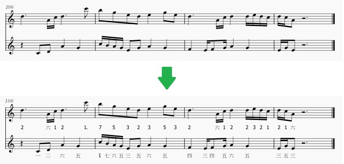

# Musescore plugin for adding numbered musical notations for Shinobue

I referred the following plugin to create a new one

* [Add Jianpu numbers as text (lyrics): 五线谱->简谱](https://musescore.org/en/project/add-jianpu-numbers-text-lyrics-wuxianpu-jianpu)

The original plugin only adds the number below the sheet.

This plugin will additionally:

1. convert the number to the kanji if the `octave` attribute is less than `6`
2. put a point beside the number if the attribute is greater than `6`

## Preview

## Compatibility

This plugin does work on version 4.5